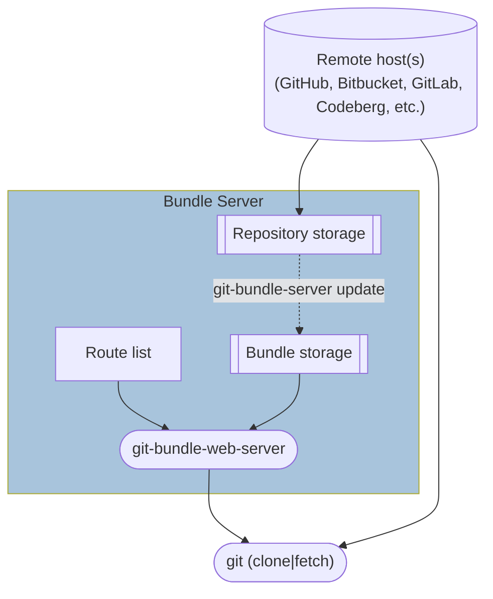

# Bundle Server Architecture

This document contains information about the architecture of the bundle server
and how it is used with Git's [bundle-uri feature][bundle-uris].

[bundle-uris]: https://git-scm.com/docs/bundle-uri

## High-level design

The following diagram shows the relationship between the Git remote, Git client,
and the bundle server with respect to typical end-user usage.

### Components

#### Remote host(s)

The Git hosts corresponding to the repositories served by the bundle server. The
bundle server can contain repositories from different remotes (e.g. one from
GitHub, another from GitLab), but each repository will have only one upstream
remote.

#### Repository storage

A collection of Git bare repositories cloned from the corresponding remote(s),
each representing a configured route on the bundle server. Repositories are
cloned into local storage at the path `~/git-bundle-server/git/<route>` (e.g.
`~/git-bundle/server/git/torvalds/linux` for the route `torvalds/linux`).

These repositories are kept up-to-date with their corresponding remote using
`git-bundle-server update`, either run manually or via the system scheduler
automatically started with `git-bundle-server (init|start)`. The repos are the
source of the bundles generated for the "Bundle storage" of each route.

#### Bundle storage

The base and incremental bundles for each active repository on the bundle
server. Bundles are created from the bundle server's cloned bare repositories
(see "Repository storage") and are stored on disk at the path
`~/git-bundle-server/www/<route>`, alongside a "bundle list" listing each bundle
and associated metadata. These files are served to the user via the
`git-bundle-web-server` API.

#### Route list

The list of _active_ routes in the bundle server (i.e., those for which bundles
are being generated and can be served via the web server).

#### `git-bundle-web-server`

The `git-bundle-web-server` executable built from this repository. It can be run
in the foreground directly, or started in the background with `git-bundle-server
web-server start`.

#### `git (clone|fetch)`

The Git client invoked by users, CI, IDEs, etc. Only the `clone` and `fetch`
commands use a bundle URI.

To bootstrap a repository from a given bundle URI, clone with `git clone
--bundle-uri=<uri>`. This will download all bundles from the bundle server
before fetching the remaining reachable objects from the origin remote.

When using this bundle server, `git clone --bundle-uri` will set the
`fetch.bundleURI` configuration key in the repository. Using this configuration,
future `git fetch` calls will also [check the bundle server for new
bundles][bundle-uri-fetch] according to the `creationToken` heuristic before
fetching from the origin remote.

[bundle-uri-fetch]: https://git-scm.com/docs/bundle-uri#_fetching_with_bundle_uris
