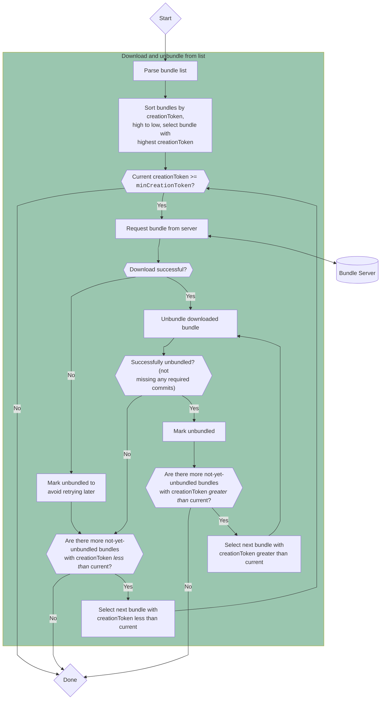
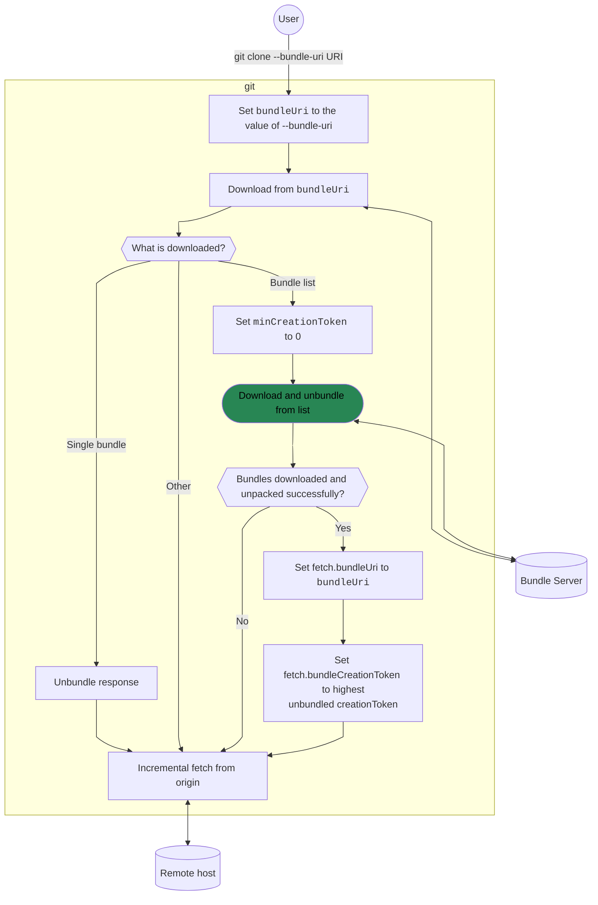
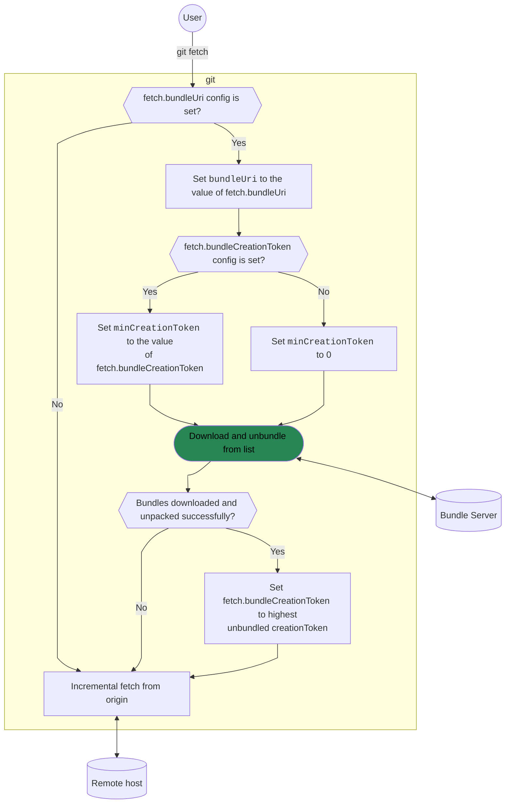

# Bundle Server Architecture

This document contains information about the architecture of the bundle server
and how it is used with Git's [bundle-uri feature][bundle-uris].

[bundle-uris]: https://git-scm.com/docs/bundle-uri

## High-level design

The following diagram shows the relationship between the Git remote, Git client,
and the bundle server with respect to typical end-user usage.

### Components

#### Remote host(s)

The Git hosts corresponding to the repositories served by the bundle server. The
bundle server can contain repositories from different remotes (e.g. one from
GitHub, another from GitLab), but each repository will have only one upstream
remote.

#### Repository storage

A collection of Git bare repositories cloned from the corresponding remote(s),
each representing a configured route on the bundle server. Repositories are
cloned into local storage at the path `~/git-bundle-server/git/<route>` (e.g.
`~/git-bundle/server/git/torvalds/linux` for the route `torvalds/linux`).

These repositories are kept up-to-date with their corresponding remote using
`git-bundle-server update`, either run manually or via the system scheduler
automatically started with `git-bundle-server (init|start)`. The repos are the
source of the bundles generated for the "Bundle storage" of each route.

#### Bundle storage

The base and incremental bundles for each active repository on the bundle
server. Bundles are created from the bundle server's cloned bare repositories
(see "Repository storage") and are stored on disk at the path
`~/git-bundle-server/www/<route>`, alongside a "bundle list" listing each bundle
and associated metadata. These files are served to the user via the
`git-bundle-web-server` API.

#### Route list

The list of _active_ routes in the bundle server (i.e., those for which bundles
are being generated and can be served via the web server).

#### `git-bundle-web-server`

The `git-bundle-web-server` executable built from this repository. It can be run
in the foreground directly, or started in the background with `git-bundle-server
web-server start`.

#### `git (clone|fetch)`

The Git client invoked by users, CI, IDEs, etc. Only the `clone` and `fetch`
commands use a bundle URI.

To bootstrap a repository from a given bundle URI, clone with `git clone
--bundle-uri=<uri>`. This will download all bundles from the bundle server
before fetching the remaining reachable objects from the origin remote.

When using this bundle server, `git clone --bundle-uri` will set the
`fetch.bundleURI` configuration key in the repository. Using this configuration,
future `git fetch` calls will also [check the bundle server for new
bundles][bundle-uri-fetch] according to the `creationToken` heuristic before
fetching from the origin remote.

[bundle-uri-fetch]: https://git-scm.com/docs/bundle-uri#_fetching_with_bundle_uris

## Use with `git`

Although the contents of the bundle server can be downloaded manually, the
intended use case of the bundle server is to supplement clones & fetches in Git.

In the following diagrams, we will be assuming use of characteristics matching
_this_ bundle server implementation, namely the `creationToken` heuristic.
Behavior in Git may differ if using a different server implementation.

### Downloading and unpacking a bundle list

The recommended use of this bundle server is as a source for a "bundle list": an
ordered list of base and incremental bundles that, in order, can be downloaded
and unbundled to populate the requested commits in a fetch or clone. At the core
of the bundle URI code in both `git clone` and `git fetch` is a common process
for downloading and unpacking the contents of a bundle list. The process is as
follows:

Note that this flow requires a `minCreationToken`: a creationToken value used to
avoid redundant downloads of old bundles. This value depends on whether the
algorithm is called from `git clone` or `git fetch`. Details on how this value
is determined can be found in later sections.

### `git clone`

When performing an initial clone from a remote repository, the `--bundle-uri`
option can point to a bundle list (recommended with this server) or to a single
base bundle. In the case of a bundle list, the bundle URI will be stored along
with a `minCreationToken` value in the repository config for subsequent fetches.

### `git fetch`

After successfully cloning with a bundle list URI (recommended) or manually
setting `fetch.bundleUri`, `git fetch` will try to download and unpack recent
bundles containing new commits.

